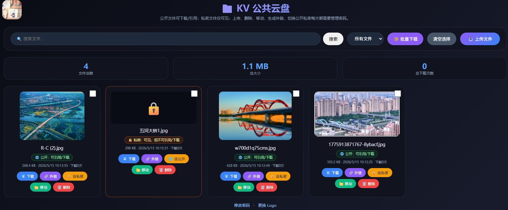

# KV 公共云盘加固版部署说明

## 1. 文件说明

- `worker_kv_secure.js`：完整可替换 Worker 代码。
- 你的 Worker 项目中可以把它重命名为 `_worker.js` 或 `src/index.js`，取决于你的部署方式。

## 2. 本版本主要改动

1. 继续使用 Workers KV 存储文件。
2. 文件列表、下载链接、分享链接仍然公开。
3. 上传、删除、移动、生成外链、修改 Logo、修改密码全部改为后端密码校验。
4. 增加上传大小限制，默认 24 MiB。
5. 屏蔽高风险文件类型，例如 html、svg、js、exe、sh、bat、php 等。
6. 修复文件总大小统计错误，新增 `sizeBytes` 原始字节统计。
7. 修复中文文件名下载次数可能统计异常的问题。
8. 修复无法移动回根目录的问题。
9. 修复 KV list 未分页导致文件多时漏显示的问题。
10. 删除文件时同步清理该文件关联的分享链接。
11. 避免把文件名和外链内容直接拼进 innerHTML，降低 XSS 风险。
12. 密码修改后写入 KV 哈希记录，不再继续写入旧版明文密码。

## 3. 变量名称

### 必须配置

| 类型 | 名称 | 说明 |
|---|---|---|
| KV Binding | `music_kv` | Workers KV 命名空间绑定名，代码中固定使用 `env.music_kv` |
| 环境变量或 Secret | `ADMIN_PASSWORD` | 初始管理密码。建议至少 8 位 |

### 可选配置

| 类型 | 名称 | 默认值 | 说明 |
|---|---|---:|---|
| 环境变量 | `MAX_FILE_SIZE_BYTES` | `25165824` | 单文件上传大小限制，默认 24 MiB。不能超过 KV 单 value 上限 25 MiB |
| 环境变量 | `BLOCKED_EXTENSIONS` | 内置列表 | 额外屏蔽的扩展名，用英文逗号分隔，例如 `md,xml,docm` |

内置屏蔽扩展名包括：

```text
html, htm, svg, js, mjs, cjs, wasm, css,
php, phtml, asp, aspx, jsp,
sh, bash, zsh, bat, cmd, ps1,
exe, dll, so, dmg, app, apk, jar,
scr, msi, com, vbs, wsf
```

## 4. Cloudflare Workers 部署方式

### 方式 A：Dashboard 在线部署

1. 打开 Cloudflare Dashboard。
2. 进入 `Workers & Pages`。
3. 新建或打开你的 Worker。
4. 把 `worker_kv_secure.js` 的内容复制进去。
5. 进入 Worker 的 `Settings`。
6. 找到 `Bindings`。
7. 添加 KV Namespace Binding：
   - Variable name / Binding name：`music_kv`
   - KV namespace：选择你的 KV 命名空间
8. 添加环境变量或 Secret：
   - `ADMIN_PASSWORD`：你的初始管理密码
   - 可选：`MAX_FILE_SIZE_BYTES`
   - 可选：`BLOCKED_EXTENSIONS`
9. 保存并部署。

### 方式 B：Wrangler 部署

假设你的入口文件是 `src/index.js`，可以把 `worker_kv_secure.js` 放到：

```text
src/index.js
```

示例 `wrangler.toml`：

```toml
name = "kv-cloud-drive"
main = "src/index.js"
compatibility_date = "2026-05-15"

[[kv_namespaces]]
binding = "music_kv"
id = "替换成你的KV命名空间ID"

[vars]
MAX_FILE_SIZE_BYTES = "25165824"
BLOCKED_EXTENSIONS = "html,htm,svg,js,mjs,cjs,wasm,css,php,exe,sh,bat,cmd,ps1"
```

设置初始管理密码：

```bash
wrangler secret put ADMIN_PASSWORD
```

然后部署：

```bash
wrangler deploy
```

## 5. Pages 部署说明

如果你部署在 Cloudflare Pages Functions，需要把 Worker 代码放到合适的 Functions 入口中，例如：

```text
functions/[[path]].js
```

然后在 Pages 项目设置中添加 KV 绑定：

```text
Binding name: music_kv
```

同时添加环境变量或 Secret：

```text
ADMIN_PASSWORD
MAX_FILE_SIZE_BYTES
BLOCKED_EXTENSIONS
```

注意：如果你原来是纯 `_worker.js` 的 Workers 部署，最简单是继续用 Workers 部署，不要迁移到 Pages Functions。

## 6. 初始密码与修改密码

首次部署后，管理密码来源顺序：

1. KV 中的 `config:admin_password_hash`
2. 旧版 KV 明文密码 `admin_password`
3. 环境变量或 Secret：`ADMIN_PASSWORD`
4. 代码兜底默认值：`ww1234`

正式部署建议务必设置 `ADMIN_PASSWORD`，不要依赖代码里的 `ww1234`。

访问：

```text
/admin
```

可以修改管理密码。修改后会写入 KV：

```text
config:admin_password_hash
```

旧版明文密码 key：

```text
admin_password
```

会被清理。

## 7. 使用说明

- 首页 `/`：文件列表、上传、搜索、移动、删除、生成外链。
- `/admin`：修改管理密码。
- `/picture`：修改 Logo 图片和跳转链接。
- `/api/download/:id`：公开下载。
- `/s/:shareId`：公开分享链接。

## 8. 重要限制

1. 由于继续使用 KV，单个文件不能超过 Workers KV 单 value 限制。
2. 本版本默认限制为 24 MiB。
3. KV 更适合小文件、图片、文档、少量音频，不适合大型音乐库或视频库。
4. 本版本只防止恶意上传和配置篡改，不做文件内容私密访问控制。
5. 文件列表和下载接口是公开的，这与你的需求“存储的文件无需保密”一致。


